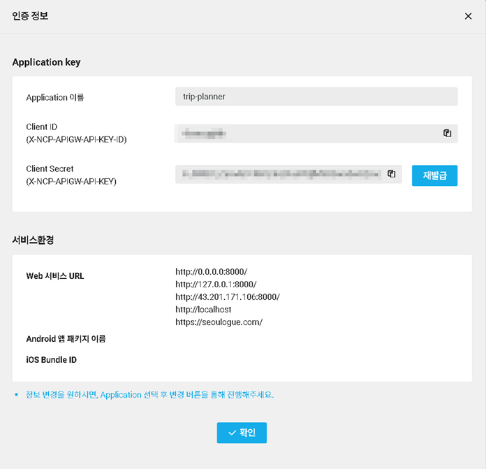
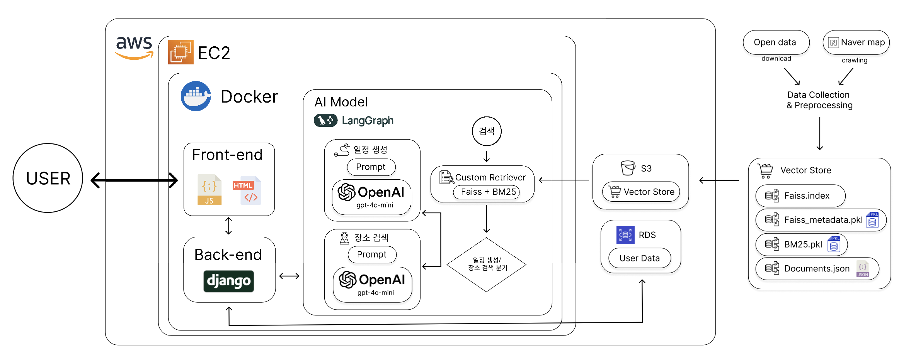
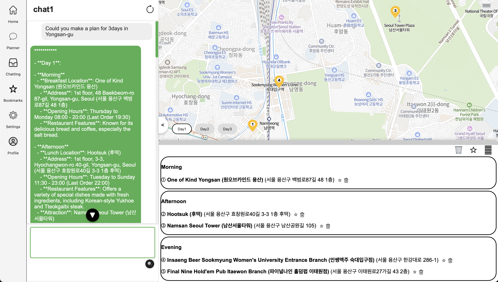

# SKN04-FINAL-3Team

# 🤗 Team Name : SeouLogue
 
### 🤭 Team Members

<p align="center">
  <table>
	<tr>
	  <td align="center">
		<br>박병헌 [팀장] <p> Park Byung Hun [Team Manager]
	  </td>
	  <td align="center">
		<br>이지수 <p> Lee Ji Su
	  </td>
	  <td align="center">
		<br>이진섭 <p> Lee Jin Seop
	  </td>
	  <td align="center">
		<br>오종수 <p> O Jong Su
	  </td>
	</tr>
  </table>
</p>

### 💼 Role Assignment

### 👨‍💻 박병헌 Park Byung Hun
- **Langgraph Structure Development**
- **Retriever Construction (RAG system)**
- **Prompting**
- **README** 

### 👨‍💻 이지수 Lee Ji Su
- **Front-end** 
- **Back-end(DB)**
- **AWS Web Deployment**


### 👩‍💻 이진섭 Lee Jin Seop
- **Back-end**
- **Model Evaluation** 
- **README** 

### 👨‍💻 오종수 O Jong Su
- **Front-end**

---

## Project Overview
Following the COVID-19 pandemic, Korea’s tourism industry has been revitalized with a rapid increase in the number of foreign tourists. In 2023, approximately 11.03 million international visitors came to Korea, spending an estimated 11 trillion KRW in total. This amount surpasses the annual revenue of Korea's leading IT company, Naver, which recorded about 9 trillion KRW in 2023 — a testament to the substantial impact of tourism on the Korean economy.

The majority of tourists come from Japan, China, and the United States, a trend that is expected to continue accelerating. However, foreign visitors often face difficulties due to Korea’s Korean-centric app environment. For instance, Google Maps cannot fully function in Korea due to national security restrictions that prevent the export of map data. Naver Maps lacks comprehensive multilingual support and offers low translation accuracy. Kakao Maps struggles with recognizing English addresses. As a result, tourists are forced to juggle multiple global and local apps to navigate their trip, leading to a fragmented and inconvenient experience.

This project aims to solve such issues by developing an integrated, multilingual platform that enables international tourists to easily and conveniently explore Korea. By doing so, we hope to enhance tourist satisfaction and contribute to the continued growth of Korea’s tourism sector.

## Data

Naver Map Crawling <br>
Target Areas: Yongsan-gu, Gangnam-gu, Jongno-gu, Jung-gu <br>
Keywords: Restaurants, Cafes, Bars
<br>
<br>
Open Data Sources<br>
Target Areas: Yongsan-gu, Gangnam-gu, Jongno-gu, Jung-gu <br>
한국보건산업진흥원_외국인환자 유치기관 현황 (Medical Institutions for Foreign Patients): https://www.data.go.kr/data/3050000/fileData.do<br>
서울시 의료관광허가 의료기관 정보 (Seoul Medical Tourism Licensed Institutions): https://data.seoul.go.kr/dataList/OA-12973/S/1/datasetView.do <br>
서울시 관광 음식 (Seoul Tourism Food): https://data.seoul.go.kr/dataList/OA-21054/S/1/datasetView.do<br>
서울시 관광 명소 (Seoul Tourist Attractions): https://data.seoul.go.kr/dataList/OA-21050/S/1/datasetView.do<br>
서울특별시_관광 쇼핑 (Seoul Shopping Destinations): https://data.seoul.go.kr/dataList/OA-21053/S/1/datasetView.do<br>
서울특별시_관광 문화 (Seoul Cultural Spots): https://data.seoul.go.kr/dataList/OA-21052/S/1/datasetView.do<br>
서울특별시_ 관광 자연 (Seoul Nature Tourism): https://data.seoul.go.kr/dataList/OA-21051/S/1/datasetView.do<br>
서울특별시_관광거리 정보 (Seoul Tourist Streets): https://data.seoul.go.kr/dataList/OA-12929/S/1/datasetView.do<br>
서울특별시_ 관광안내소 (Tourist Information Centers): https://data.seoul.go.kr/dataList/OA-20350/S/1/datasetView.do<br>
관광숙박업 (Tourism Accommodations): https://www.localdata.go.kr/data/dataView.do


## Preprocess

1.	Regional Data Segmentation<br>
	•	Data was organized by administrative districts in Seoul to enhance search and analysis efficiency.
2.	Multilingual Address Column<br>
•	Additional columns were created with translated addresses tailored to tourists’ nationalities.
3.	Data Embedding & Storage<br>
•	Using the text-embedding-3-small model, the cleaned data was embedded and stored in a FAISS database for high-speed vector search.<br>
•	BM25 algorithm was also employed to enhance keyword-based search accuracy.
---


## 기술 스택

| **Category**           | **Tools**                                                                                                                                                                                                                                                                                                                                |
|------------------------|-------------------------------------------------------------------------------------------------------------------------------------------------------------------------------------------------------------------------------------------------------------------------------------------------------------------------------------------|
| **Data Modeling**      |      |
| **SCM**                |                                                                                                                                                                                                                                            |
| **Front-End / Back-End** |                                                                                                                                                                                                                                                                        |
| **Deploy**             |                                                                                                                                                                                                                                                                  |

## Prerequisites


### Create and Activate Conda Environment ## 
```
conda create -n myenv python=3.11
conda activate myenv
pip install -r requirements.txt
```
---

### Required .env File 

<p>

```
OPENAI_API_KEY=***********
NCP_CLIENT_ID=***********
NCP_CLIENT_SECRET=***********
faiss_path=./data/db
DB_NAME=postgres
DB_USER=seoulogue
DB_PASSWORD=***********
DB_HOST='***********'
DB_PORT=****
LANGCHAIN_TRACING_V2=true
LANGCHAIN_ENDPOINT="https://api.smith.langchain.com/"
LANGCHAIN_API_KEY="***********"
LANGCHAIN_PROJECT="practice"
TAVILY_API_KEY=***********
DJANGO_SECRET_KEY="***********"
```
### Naver Map API 

To use the Naver API, issue the client ID and secret key and register your site URL on the Naver developer portal.



## Running the Service Locally

### Update DATABASES in settings.py as follows:

<p>

```
DATABASES = {
    'default': {
        'ENGINE': 'django.db.backends.postgresql',
        'NAME': 'postgres',  # 데이터베이스 이름
        'USER': 'postgres',       # PostgreSQL 사용자 이름
        'PASSWORD': '****',   # PostgreSQL 사용자 비밀번호
        'HOST': '127.0.0.1',           # 또는 DB 서버 IP
        'PORT': '5432',                # 기본값
    }
}
```

### Django Command Sequence
```
cd web
python manage.py makemigrations
python manage.py migrate
python manage.py createsuperuser # 본인 계정 생성
python manage.py collectstatic
yes
python manage.py runserver
```

## System Architecture

<p>
  
</p>


## Service Overview


Service Web Page<br>

When users interact with the chatbot to request itinerary planning or place recommendations, summarized lists of recommended places are shown at the bottom of the map. <br>

The selected destinations are marked on the map in the order of visit. Itineraries and individual locations can be saved to the user’s favorites.<br>

Chat conversations are stored in a chat history, allowing users to revisit or continue previous queries. However, personalization features such as saving itineraries or chat logs require login.


## Reflections


### 👨‍💻 박병헌 (Park Byung Hu): 
The process was more challenging than expected, especially fine-tuning the model. But working as a team kept me going. I gained hands-on experience with LangGraph, Git, LangChain, and deployment.


### 👨‍💻 이지수 (Lee Ji Su):

I was in charge of developing the backend with Django and implementing key website features. This experience helped me understand Django’s structure and its components deeply. It was also a valuable chance to think through how to construct an efficient database. Using Jira and Confluence helped the team track progress and manage documents effectively.

### 👩‍💻 이진섭 (Lee Jin Seop): 
It was my first time working on a long-term project with others. Though we had technical difficulties and disagreements, I’m grateful and happy we completed it successfully.

### 👨‍💻 오종수 (O Jong Su):
We lacked clear goals in the early planning phase, which led to unexpected challenges. That’s something to improve on in the future.
